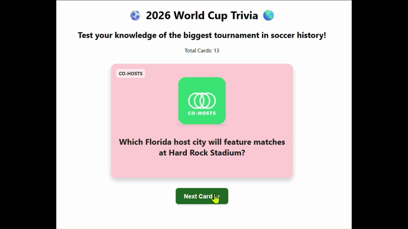

# Web Development Project 2 - 2026 World Cup Trivia Flashcards

Submitted by: **Harold Alexander Silva**

This web app: **A React-based flashcard application designed to test users' knowledge of the upcoming 2026 FIFA World Cup, featuring tournament history, host city facts, and regional qualifiers.**

Time spent: **12** hours spent in total

## Required Features

The following **required** functionality is completed:

- [x] Title of card set is displayed
- [x] A short description of the card set is displayed
- [x] A list of card pairs is created (13 unique cards)
- [x] The total number of cards in the set is displayed
- [x] A single card at a time is displayed
- [x] Only one half of the information pair is displayed at a time
- [x] Clicking on a card flips it over, showing the back with corresponding information
- [x] Clicking on a flipped card again flips it back, showing the front
- [x] Clicking the next button displays a random new card

The following **stretch** features are implemented:

- [x] Cards contain images in addition to or in place of text
- [x] Cards have different visual styles such as color based on their category

## Video Walkthrough

Here's a walkthrough of what was implemented:

## Notes

### Challenges Encountered
- **Media Constraints & Tooling Issues**: Faced difficulties exporting the mandatory app walkthrough as a `.gif` using Clipchamp because the software restricts GIF exports strictly to videos that are 15 seconds or less. Resolved this by capturing a direct screen recording as an MP4 and converting it via an external web tool.
- **Styling & Layout Refinements**: Overcame styling conflicts by clearing default Vite global styles in `index.css` to ensure proper text contrast and visibility.
- **State Retention Bug**: Resolved state retention bugs when clicking the "Next Card" button by implementing a unique `key` property based on the card ID, ensuring the new card renders the "front" question correctly.
- **Image 404 Errors**: Bypassed external image server blocking (404 errors) by creating custom SVG vector graphics locally in the `public` directory, guaranteeing that category images render instantly and reliably.

### Resources Used
- **Vite & React**: For fast local development and component-based state management.
- **SVG Graphics**: Generated custom local vector graphic code to handle UI visuals without relying on external image servers.
- **Ezgif**: Utilized for finalizing the video walkthrough asset into the required `.gif` format.